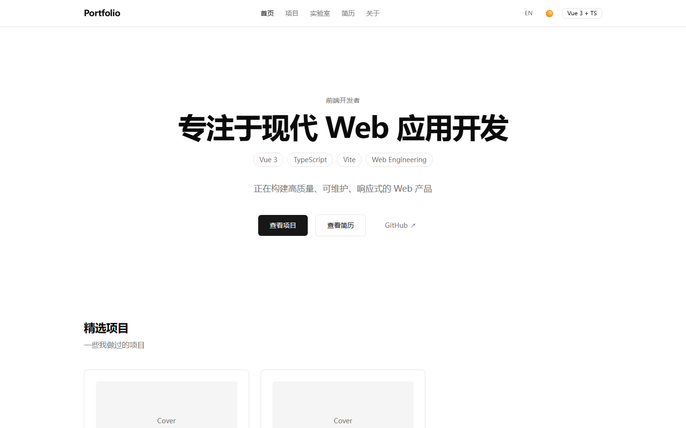
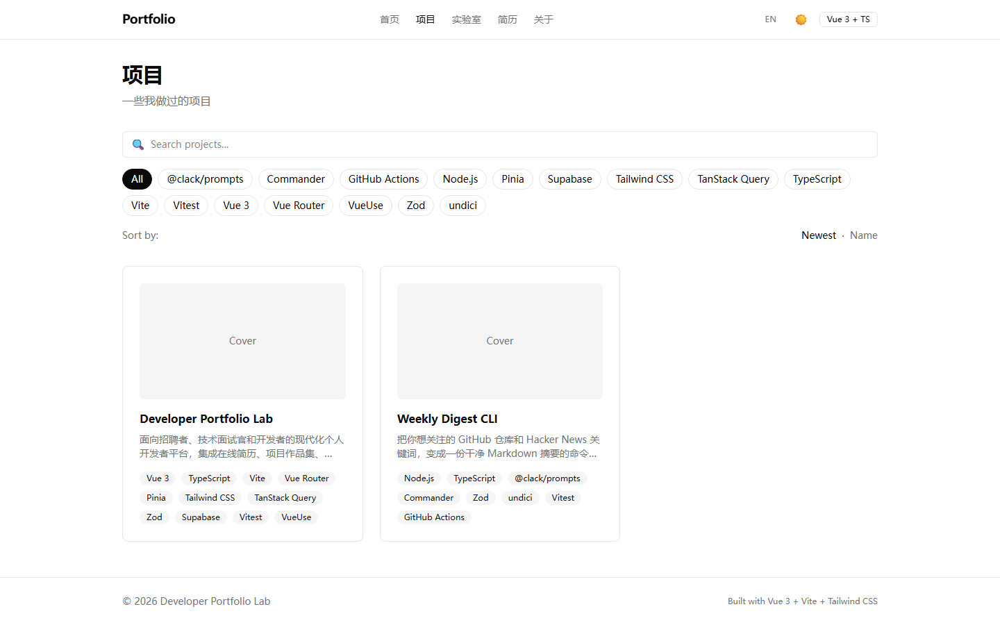
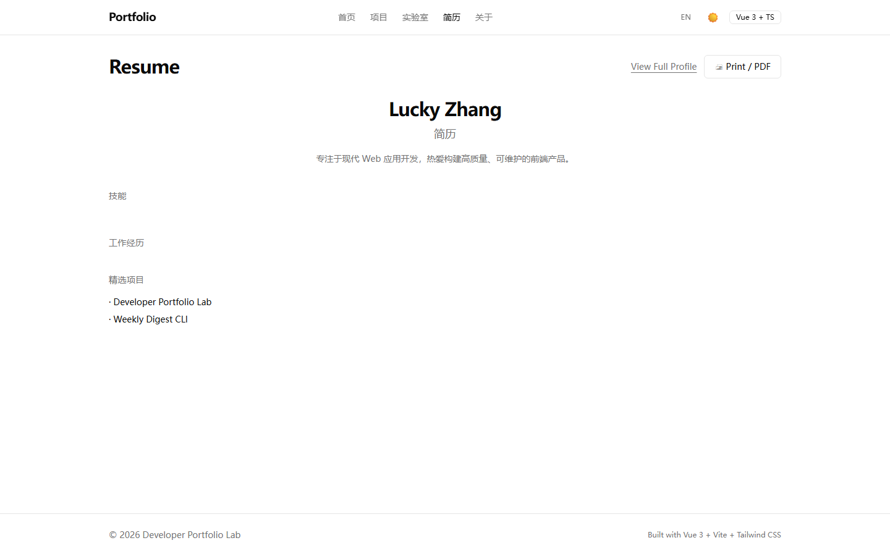

# Developer Portfolio Lab

一个面向招聘者、技术面试官和开发者的现代化个人开发者平台。通过真实的组件交互、异步数据、状态管理、表单、测试、性能优化和 CI/CD，完整展示现代 Web 前端工程能力。

**在线 Demo：** https://developer-portfolio-lab.vercel.app


## 为什么做这个项目

静态作品集无法证明工程能力。这个平台刻意以「招聘者会怎么评估一个前端开发者」为出发点构建：

- **简历页** —— 招聘者视图 + 打印版在线简历
- **项目作品集** —— 展示真实项目的问题 → 方案 → 架构 → 工程决策
- **Frontend Lab** —— 6 个交互式模块演示真实工程能力（虚拟列表、拖拽看板、命令面板、数据表格、组件系统、仪表盘）
- **Admin 后台** —— 内容通过 Supabase 管理，演示完整的前后端协作
- **工程素养** —— 34 个单元测试、9 个 E2E 用例、CI/CD、Lighthouse 94 分

## 截图

| 首页 | 项目列表 |
|---|---|
|  |  |

| 简历页 |
|---|
|  |

## 功能特性

- **在线简历**：招聘者视图 / 详细视图 / 打印视图（`?mode=print` + 打印按钮）
- **项目作品集**：Featured 项目、搜索过滤、详情页（问题/方案/架构/技术决策/工程清单/性能指标）
- **Frontend Lab**：虚拟列表（万行渲染）、拖拽看板、命令面板（Ctrl+K）、数据表格、组件系统、仪表盘
- **文章**：Markdown 内容管理（Admin）
- **后台管理**：Projects / Articles / Resume / Settings 完整 CRUD + 路由守卫 + Supabase Auth
- **国际化**：简体中文 / English，浏览器语言自动检测，全站覆盖
- **暗色模式**：system / light / dark 三态，无闪烁（FOUC 防护）
- **SEO**：语义化 HTML、meta 描述、可访问性（WCAG 2.x：aria / label-for / focus-visible / reduced-motion）

## 技术栈

| 类别 | 技术 |
|---|---|
| 框架 | Vue 3.5（Composition API + `<script setup>`）、TypeScript（strict） |
| 构建 | Vite、pnpm |
| 路由 / 状态 | Vue Router、Pinia |
| 服务端状态 | TanStack Vue Query 5 |
| 样式 | Tailwind CSS 4、CSS 变量设计令牌 |
| 后端 | Supabase（Postgres + Auth + RLS + Storage） |
| 校验 | Zod 4 |
| 工具 | VueUse、shadcn-vue |
| 测试 | Vitest（34 单测）、Playwright（9 E2E） |
| 质量 | ESLint、Prettier、vue-tsc、GitHub Actions CI |
| 部署 | Vercel |

## 项目结构

```
src/
├── app/          # 应用级：路由、Supabase client、i18n、Zod schema
├── components/   # 全局共享：layout、shared
├── composables/  # 可复用逻辑（useTheme / useAuth / useCommandPalette…）
├── services/     # 数据访问层（Supabase CRUD，全部被测试覆盖）
└── features/     # 按业务域组织（home/resume/projects/lab/about/admin）
```

遵循 **feature-based 目录 + 轻量分层**（详见 [ADR-001](docs/adr/ADR-001.md)）：依赖单向流动、高内聚低耦合、小文件、类型先行。

## 快速开始

```bash
pnpm install
cp .env.example .env   # 填入 Supabase URL 与 key
pnpm dev               # http://localhost:5173
```

环境变量：

| 变量 | 说明 |
|---|---|
| `VITE_SUPABASE_URL` | Supabase 项目 URL |
| `VITE_SUPABASE_PUBLISHABLE_KEY` | Supabase 公开 key（客户端） |

## 测试

```bash
pnpm type-check   # vue-tsc 严格检查
pnpm test         # Vitest 单元测试（34 个）
pnpm e2e          # Playwright E2E（3 条核心路径，9 个用例）
pnpm build        # 生产构建
```

CI（GitHub Actions）流水线：lint → type-check → 单测 → build → E2E。

## 部署

1. **Supabase**：执行 `supabase/migrations/001_initial_schema.sql`（7 张表 + RLS + 触发器），创建 Admin 用户
2. **Vercel**：`vercel deploy --prod`，配置 `VITE_SUPABASE_URL` 与 `VITE_SUPABASE_PUBLISHABLE_KEY` 环境变量

生产配置见 `vercel.json`（构建命令 + SPA rewrites）。

## 文档

- [需求计划](需求计划.md) / [TODO](TODO.md)
- [01-PRD-产品需求文档](docs/01-PRD-产品需求文档.md)
- [02-页面原型结构](docs/02-页面原型结构.md)
- [03-技术架构设计](docs/03-技术架构设计.md)
- [04-数据库设计](docs/04-数据库设计.md)
- [05-Git任务拆分与里程碑](docs/05-Git任务拆分与里程碑.md)
- [06-AI-Coding执行规范](docs/06-AI-Coding执行规范.md)
- [07-代码质量约束清单](docs/07-代码质量约束清单.md)
- [架构决策记录（ADR）](docs/adr/)

## 关联项目

- **Weekly Digest CLI** —— [github.com/luckerbai/weekly-digest-cli](https://github.com/luckerbai/weekly-digest-cli)：Node.js CLI 工具，GitHub 仓库 + Hacker News 聚合生成 Markdown 周报（35 个单测 + CI），作为真实项目展示在本平台的精选项目中。

## 许可证

MIT
